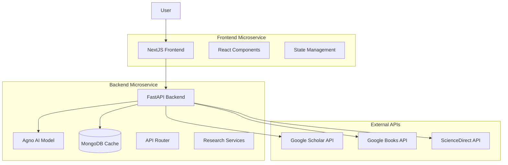

# Design Document

## Overview

The AI Research Agent is a fullstack application built with a microservices architecture that provides comprehensive research capabilities by aggregating information from multiple academic sources. The system consists of a NextJS frontend for user interaction, a FastAPI backend with AI model integration for processing research queries, and MongoDB for caching to optimize performance and reduce API costs.

## Architecture

### System Architecture Diagram



### Service Communication

- **Frontend ↔ Backend**: REST API over HTTP/HTTPS
- **Backend ↔ External APIs**: HTTP requests with proper authentication
- **Backend ↔ Database**: MongoDB connection with connection pooling
- **Internal Backend**: Direct function calls between services

## Components and Interfaces

### Frontend Components (NextJS)

#### Core Components
- **ResearchForm**: Input form for research queries
- **ResultsDisplay**: Component to display research findings
- **LoadingIndicator**: Shows progress during research
- **ErrorBoundary**: Handles and displays errors gracefully

#### Pages
- **Home Page** (`/`): Main research interface
- **Results Page** (`/results/[id]`): Detailed results view
- **History Page** (`/history`): Previous research queries

#### State Management
- **React Query**: For API state management and caching
- **Context API**: For global application state
- **Local State**: Component-specific state with useState

### Backend Components (FastAPI)

#### API Endpoints
```python
# Research endpoints
POST /api/research/query - Submit new research query
GET /api/research/results/{query_id} - Get research results
GET /api/research/history - Get user's research history
GET /api/research/status/{query_id} - Check research status

# Health and monitoring
GET /api/health - Service health check
GET /api/metrics - Service metrics
```

#### Core Services
- **ResearchOrchestrator**: Coordinates research across all sources
- **GoogleScholarService**: Handles Google Scholar API integration
- **GoogleBooksService**: Manages Google Books API calls
- **ScienceDirectService**: Interfaces with ScienceDirect API
- **CacheService**: Manages MongoDB caching operations
- **AgnoAIService**: Integrates Python Agno AI model for intelligent research synthesis, analysis, and insight generation

#### Data Models
```python
class ResearchQuery(BaseModel):
    id: str
    query: str
    user_id: Optional[str]
    timestamp: datetime
    status: QueryStatus
    
class ResearchResult(BaseModel):
    query_id: str
    sources: Dict[str, List[SourceResult]]
    summary: str
    confidence_score: float
    cached: bool
    
class SourceResult(BaseModel):
    title: str
    authors: List[str]
    abstract: Optional[str]
    url: Optional[str]
    publication_date: Optional[datetime]
    source_type: SourceType
```

## Data Models

### MongoDB Collections

#### research_queries
```javascript
{
  _id: ObjectId,
  query_id: String,
  query_text: String,
  user_id: String,
  timestamp: Date,
  status: String, // "pending", "processing", "completed", "failed"
  metadata: {
    ip_address: String,
    user_agent: String
  }
}
```

#### research_results
```javascript
{
  _id: ObjectId,
  query_id: String,
  results: {
    google_scholar: [{
      title: String,
      authors: [String],
      abstract: String,
      citation_count: Number,
      url: String,
      publication_year: Number
    }],
    google_books: [{
      title: String,
      authors: [String],
      description: String,
      isbn: String,
      preview_link: String,
      published_date: String
    }],
    sciencedirect: [{
      title: String,
      authors: [String],
      abstract: String,
      doi: String,
      journal: String,
      publication_date: Date
    }]
  },
  ai_summary: String,
  confidence_score: Number,
  created_at: Date,
  expires_at: Date
}
```

#### cache_metadata
```javascript
{
  _id: ObjectId,
  query_hash: String, // MD5 hash of normalized query
  last_updated: Date,
  hit_count: Number,
  query_variations: [String]
}
```

## Error Handling

### Error Categories

#### API Errors
- **Rate Limiting**: Implement exponential backoff and retry logic
- **Authentication Failures**: Log and alert, continue with available sources
- **Network Timeouts**: Retry with increasing timeouts, fallback to cache
- **Invalid Responses**: Validate and sanitize all external API responses

#### Database Errors
- **Connection Failures**: Implement connection pooling and retry logic
- **Query Timeouts**: Optimize queries and implement proper indexing
- **Data Validation**: Validate all data before storage

#### Frontend Errors
- **Network Errors**: Display user-friendly messages with retry options
- **Rendering Errors**: Use Error Boundaries to prevent app crashes
- **State Errors**: Implement proper error states in components

### Error Response Format
```python
class ErrorResponse(BaseModel):
    error: str
    message: str
    details: Optional[Dict]
    timestamp: datetime
    request_id: str
```

## Testing Strategy

### Frontend Testing
- **Unit Tests**: Jest and React Testing Library for components
- **Integration Tests**: Test API integration and user flows
- **E2E Tests**: Playwright for complete user journey testing
- **Visual Tests**: Storybook for component documentation and testing

### Backend Testing
- **Unit Tests**: pytest for individual service testing
- **Integration Tests**: Test database operations and external API mocking
- **API Tests**: FastAPI TestClient for endpoint testing
- **Load Tests**: Locust for performance and scalability testing

### Test Data Management
- **Mock Services**: Mock external APIs for consistent testing
- **Test Database**: Separate MongoDB instance for testing
- **Fixtures**: Predefined test data for consistent test scenarios

## Performance Considerations

### Caching Strategy
- **Query Normalization**: Normalize queries to improve cache hit rates
- **TTL Management**: Implement appropriate cache expiration policies
- **Cache Warming**: Pre-populate cache with common research topics

### API Optimization
- **Concurrent Requests**: Use asyncio for parallel API calls
- **Request Batching**: Batch similar requests where possible
- **Response Compression**: Implement gzip compression for API responses

### Database Optimization
- **Indexing**: Create indexes on frequently queried fields
- **Connection Pooling**: Implement efficient connection management
- **Query Optimization**: Use aggregation pipelines for complex queries

## Security Considerations

### API Security
- **Rate Limiting**: Implement per-user and global rate limits
- **Input Validation**: Sanitize and validate all user inputs
- **CORS Configuration**: Properly configure CORS for frontend access
- **API Key Management**: Secure storage and rotation of external API keys

### Data Security
- **Data Encryption**: Encrypt sensitive data at rest and in transit
- **Access Control**: Implement proper authentication and authorization
- **Audit Logging**: Log all significant operations for security monitoring

## Deployment Architecture

### Container Strategy
- **Frontend**: Docker container with Nginx for static file serving
- **Backend**: Docker container with Gunicorn and Uvicorn workers
- **Database**: MongoDB container or managed service
- **Orchestration**: Docker Compose for development, Kubernetes for production

### Environment Configuration
- **Development**: Local containers with hot reloading
- **Staging**: Mimics production with reduced resources
- **Production**: Scalable deployment with load balancing and monitoring
## Agn
o AI Integration

### Agno AI Service Architecture
The AgnoAIService integrates Python Agno for advanced AI capabilities in research synthesis and analysis:

#### Agno AI Responsibilities
- **Research Synthesis**: Combine findings from multiple sources into coherent summaries
- **Content Analysis**: Analyze research papers and books for key insights and themes
- **Query Enhancement**: Improve search queries based on initial results
- **Relevance Scoring**: Score and rank research results based on relevance to the query
- **Insight Generation**: Generate actionable insights from aggregated research data

#### Agno Integration Pattern
```python
from agno import Agent, Model

class AgnoAIService:
    def __init__(self):
        self.research_agent = Agent(
            model=Model.GPT4,  # or appropriate Agno model
            instructions="You are a research expert AI that synthesizes academic information",
            tools=[self.synthesize_research, self.analyze_relevance, self.generate_insights]
        )
    
    async def synthesize_research_results(self, query: str, results: Dict) -> ResearchSynthesis:
        """Use Agno to synthesize research from multiple sources"""
        synthesis_prompt = self._build_synthesis_prompt(query, results)
        return await self.research_agent.run(synthesis_prompt)
    
    async def analyze_research_quality(self, results: List[SourceResult]) -> QualityAnalysis:
        """Use Agno to analyze the quality and credibility of research sources"""
        analysis_prompt = self._build_quality_analysis_prompt(results)
        return await self.research_agent.run(analysis_prompt)
```

#### Agno Workflow Integration
1. **Initial Research**: External APIs gather raw research data
2. **Agno Processing**: Agno AI analyzes and synthesizes the collected information
3. **Quality Assessment**: Agno evaluates source credibility and relevance
4. **Insight Generation**: Agno generates actionable insights and recommendations
5. **Result Formatting**: Agno formats the final research output for user consumption